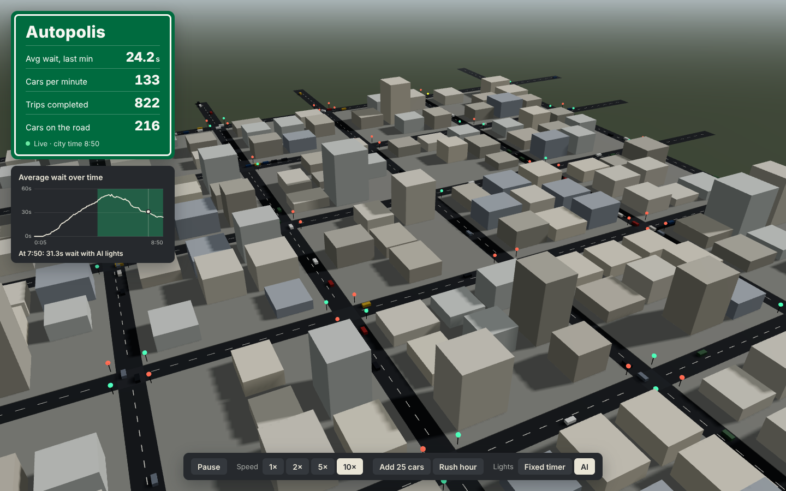
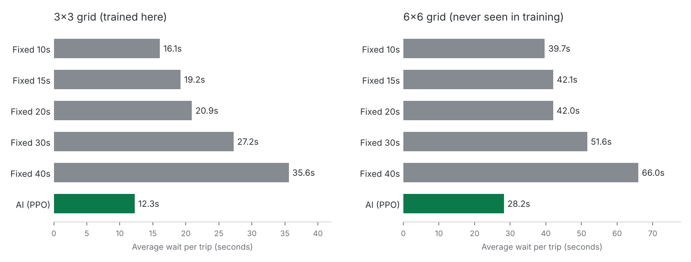

# Autopolis

A real-time 3D traffic simulation where a reinforcement learning agent runs the traffic lights.

The city is simulated in Python and streamed to the browser over a WebSocket, where React and Three.js draw it. You can watch hundreds of cars route across the city, add traffic, trigger rush hour, and flip every light between fixed timers and the trained AI. A live chart of average wait time shades the stretches where the AI was in control, so you can watch the line drop when you switch.



## Results

The AI lights were trained with PPO on a 3×3 grid, then tested against fixed-timer lights on the same traffic (5 fixed random seeds × 3 traffic levels, 15 simulated minutes each). I compared against several timer settings, not just one, because a badly tuned timer is an easy target.



| Grid | Best fixed timer | Default fixed timer (30s) | AI (PPO) | vs best fixed | vs default |
|---|---|---|---|---|---|
| 3×3 (trained here) | 16.1s (10s green) | 27.2s | **12.3s** | **−23.7%** | −55.0% |
| 6×6 (never seen in training) | 39.7s (10s green) | 51.6s | **28.2s** | **−28.9%** | −45.3% |

The AI also completes as many or more trips per run than every timer, so it isn't winning by holding cars back. Time a car spends stuck at the city entrance counts as waiting too, so a controller can't game the metric by blocking entries.

Other measurements (`python measure.py`):

- **Headless speed:** about 2,260× real time on a 3×3 city, 590× on a 6×6 city with ~250 cars, and 260× with ~870 cars.
- **Scale:** the 6×6 demo city peaks at 722 cars on the road at once during rush hour with AI lights.

Reproduce everything with `python benchmark.py` and `python benchmark.py --size 6 --rates 100 150`. Raw results are in `docs/`.

## How it works

```
 engine/  (pure Python)                api/  (FastAPI)                 web/  (React + Three.js)
 ┌───────────────────────┐   step()   ┌──────────────────────┐   WS    ┌────────────────────────┐
 │ city graph, A*,       │◀──────────▶│ runs one shared city │────────▶│ roads, buildings,      │
 │ lights, IDM, stats    │  snapshot  │ 10 frames/sec        │  JSON   │ instanced cars, lights │
 └───────────────────────┘            │ REST controls        │◀────────│ control bar, stats     │
            ▲                         └──────────────────────┘  fetch  └────────────────────────┘
            │ same engine, no rendering
 ┌───────────────────────┐
 │ engine/rl.py          │  Gymnasium env + PPO training (Stable-Baselines3)
 └───────────────────────┘
```

The main design rule: **the engine runs the city, the browser only draws it.** The engine has no idea a browser exists, which is what lets training run headless hundreds of times faster than real time.

### The simulation (`engine/`)

- **City:** a grid of intersections connected by two-way roads, stored as a directed graph (one edge per direction, so each direction has its own lane and queue). Gates around the edge are where cars enter and leave.
- **Routing:** each car gets an A* route from a random gate to another gate, using Manhattan distance as the heuristic. A small random cost jitter spreads cars across equally short routes.
- **Car-following:** cars use the [Intelligent Driver Model](https://en.wikipedia.org/wiki/Intelligent_driver_model), which picks an acceleration from the gap and speed difference to whatever is ahead. A red light is treated as a stopped car at the stop line. On top of IDM there's a hard position limit, so cars can never overlap; the tests check this every tick.
- **Lights:** a state machine of green → yellow → all-red → other direction green. The all-red interval matters: it makes every switch cost a few seconds, so "just switch constantly" isn't free.

### The AI lights (`engine/control.py`, `engine/rl.py`)

Every light is run by the **same small policy network** (parameter sharing). Each light only sees its own intersection:

- **Observation (19 numbers):** stopped cars and moving cars on each incoming road, cars on each outgoing road, the current phase, and how long it's been in that phase.
- **Action:** keep the current light, or switch. The light still has to go through yellow and all-red, and can't switch before 5 seconds of green, so the AI can't do anything a real signal couldn't.
- **Reward:** minus the waiting time that built up on that intersection's incoming roads.

Training uses a custom Stable-Baselines3 `VecEnv` where each intersection in each of 4 parallel cities is its own slot, so PPO trains one shared policy on 36 intersections at once. Because the policy only ever sees one intersection, a model trained on 3×3 can run every light in a 6×6 city, which is what the second row of the results table tests.

For serving, the trained network (19 → 64 → 64 → 2) is exported to plain NumPy (`engine/policy.py`), so the API container doesn't need PyTorch. A test checks the NumPy version picks the same actions as the original model.


**Training and benchmarks:**

```bash
pip install torch --index-url https://download.pytorch.org/whl/cpu
pip install -r requirements-train.txt
python train.py --steps 900000         # ~3-4 minutes on a laptop CPU
python benchmark.py                    # fixed timers vs AI on 3x3
python run_terminal.py --size 6        # quick headless run, prints stats
```

**Tests:** `pytest` (54 tests). CI runs them on every push, builds the frontend, and builds both Docker images.

## Project layout

```
engine/       simulation: city.py, routing.py, car.py, lights.py, sim.py
              AI: control.py (observations + controller), rl.py (Gymnasium env), policy.py (NumPy inference)
api/          FastAPI app: WebSocket stream + REST controls
web/          React + react-three-fiber frontend
tests/        pytest suite
models/       trained policy (policy.npz for serving, ppo_lights.zip for SB3)
docs/         screenshot, results chart, raw benchmark output
```

## Known limitations

- Intersections are modeled as points, so turning conflicts inside an intersection aren't simulated. Only one direction is ever green, which keeps it safe, but there are no protected left turns.
- One lane per direction, no lane changes.
- The live demo runs one shared city, so everyone viewing it sees (and controls) the same simulation. The city pauses while nobody is connected, so an idle server uses almost no CPU.
- The AI was trained on traffic between 20 and 70 cars/min on 3×3; it held up on 6×6 at 100–150 cars/min, but I haven't tested it on non-grid maps.
